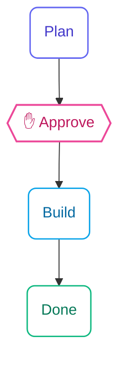
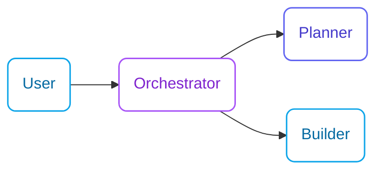

# specs.md Documentation Website

This is the documentation website for [specs.md](https://github.com/fabriqaai/specsmd), an AI-native software development framework with multi-agent orchestration.

## Tech Stack

- **Framework**: [Mintlify](https://mintlify.com) - Modern documentation platform
- **Content**: MDX (Markdown + JSX)
- **Diagrams**: Mermaid.js for flowcharts and diagrams
- **Hosting**: Mintlify Cloud

## Project Structure

```
specs.md-website/
├── docs.json                 # Mintlify configuration (navigation, theme, etc.)
├── index.mdx                 # Homepage
├── faq.mdx                   # FAQ page
├── getting-started/          # Getting started guides
│   ├── installation.mdx
│   └── quick-start.mdx
├── methodology/              # AI-DLC methodology docs
│   ├── what-is-ai-dlc.mdx
│   ├── ai-dlc-vs-agile.mdx
│   └── three-phases.mdx
├── core-concepts/            # Core concepts
│   ├── intents.mdx
│   ├── units.mdx
│   ├── bolts.mdx
│   ├── memory-bank.mdx
│   └── standards.mdx
├── agents/                   # Agent documentation
│   ├── overview.mdx
│   ├── master-agent.mdx
│   ├── inception-agent.mdx
│   ├── construction-agent.mdx
│   └── operations-agent.mdx
├── architecture/             # Architecture docs
│   └── flows.mdx
├── guides/                   # How-to guides
│   └── bolt-types.mdx
└── images/                   # Static assets
    ├── logo.png
    ├── favicon.png
    ├── hero-dark.svg
    └── hero-light.svg
```

## Running Locally

```bash
# Install Mintlify CLI
npm i -g mintlify

# Start dev server
npx mint dev
```

The site will be available at http://localhost:3000

## Navigation Configuration

Navigation is configured in `docs.json`. The structure uses nested groups:

- **Getting Started**: Installation and quick start
- **Framework**: Architecture overview
- **AI-DLC Flow**: The main methodology section
  - Concepts (Intents, Units, Bolts, Memory Bank, Standards)
  - Agents (Master, Inception, Construction, Operations)
  - Guides

## Writing Content

### MDX Components

Mintlify provides built-in components:

```mdx
<Info>Informational callout</Info>
<Warning>Warning callout</Warning>
<Card title="Title" icon="icon-name" href="/path">Description</Card>
<CardGroup cols={2}>...</CardGroup>
<Tabs><Tab title="Tab 1">...</Tab></Tabs>
<Steps><Step title="Step 1">...</Step></Steps>
<AccordionGroup><Accordion title="Title">...</Accordion></AccordionGroup>
```

### Frontmatter

Every MDX file needs frontmatter:

```yaml
---
title: Page Title
description: Brief description for SEO
---
```

## Mermaid Diagram Style Guide

Modern, clean mermaid diagrams with **white backgrounds**, colored strokes, and rounded corners.

### Key Rules

1. **Always use `actions={false}`** to hide zoom/pan controls
2. **Use `flowchart`** instead of `graph` for better styling support
3. **Use `classDef`** for reusable styles instead of inline `style` statements
4. **Use rounded nodes `()`** for a softer, modern look
5. **Use diamond nodes `{{}}`** for decision points/checkpoints
6. **White backgrounds** with colored strokes for all nodes
7. **Add `rx:8,ry:8`** for rounded corners

### Color Palette (White Background Theme)

| Role               | Fill      | Stroke    | Text      | Usage                         |
|--------------------|-----------|-----------|-----------|-------------------------------|
| Design/Primary     | `#fff`    | `#A855F7` | `#7E22CE` | Design phase, primary elements |
| Plan/Inception     | `#fff`    | `#6366F1` | `#4338CA` | Planning phase                |
| Build/Construction | `#fff`    | `#0EA5E9` | `#0369A1` | Building, implementation      |
| Done/Success       | `#fff`    | `#10B981` | `#047857` | Completed states              |
| Checkpoint/Human   | `#fff`    | `#EC4899` | `#BE185D` | Human review, validation (2px stroke) |
| Warning/Operations | `#fff`    | `#F59E0B` | `#B45309` | Operations, warnings          |

### Standard Class Definitions

```mermaid
classDef design fill:#fff,stroke:#A855F7,color:#7E22CE,stroke-width:1.5px,rx:8,ry:8
classDef plan fill:#fff,stroke:#6366F1,color:#4338CA,stroke-width:1.5px,rx:8,ry:8
classDef build fill:#fff,stroke:#0EA5E9,color:#0369A1,stroke-width:1.5px,rx:8,ry:8
classDef done fill:#fff,stroke:#10B981,color:#047857,stroke-width:1.5px,rx:8,ry:8
classDef check fill:#fff,stroke:#EC4899,color:#BE185D,stroke-width:2px,rx:8,ry:8
classDef warn fill:#fff,stroke:#F59E0B,color:#B45309,stroke-width:1.5px,rx:8,ry:8
```

### Example: Execution Flow



### Example: Agent Flow



### Example: Phase Diagram


## Brand Colors

From `docs.json`:
- Primary: `#CD6B4D` (terracotta/rust)
- Light: `#D17A5E`
- Dark: `#B85A3D`

## Important Notes

1. **Agent commands are NOT CLI commands** - They are prompts typed in AI coding tools (Claude Code, Cursor, GitHub Copilot)
2. **ASCII file trees should stay as ASCII** - They represent directory structures and are more readable than Mermaid
3. **Process flows should use Mermaid** - Flowcharts, state diagrams, and architecture diagrams
4. **Always include frontmatter** - Title and description are required for SEO

## Related Repositories

- Main specs.md CLI: https://github.com/fabriqaai/specsmd
