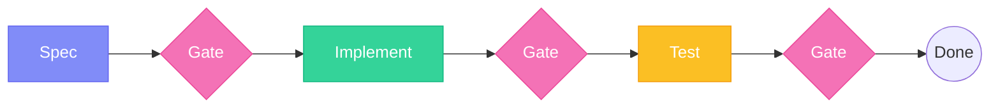

## Overview

The **Construction Agent** handles the second phase of AI-DLC. It executes bolts through validated stages, producing tested, production-ready code.

## Invocation

<Tabs>
  <Tab title="Claude Code">
    ```bash
    /specsmd-construction-agent
    ```
  </Tab>
  <Tab title="Cursor">
    ```
    /specsmd-construction-agent
    ```
    Or use the `@` prefix:
    ```
    @specsmd-construction-agent
    ```
  </Tab>
  <Tab title="GitHub Copilot">
    ```
    /specsmd-construction-agent
    ```
  </Tab>
</Tabs>

## Commands

| Command | Purpose |
|---------|---------|
| `bolt-start` | Start or continue executing a bolt |
| `bolt-status` | Check bolt progress |
| `bolt-list` | List all bolts |
| `bolt-replan` | Replan bolts if needed |

## bolt-start

Starts or continues a bolt execution:

```
> bolt-start
```

If no bolt is in progress, the agent will:

1. Show available bolts from your plan
2. Let you select which to start
3. Begin the first stage

If a bolt is in progress:

1. Load current stage context
2. Continue from where you left off

### Stage Progression

For a DDD Construction bolt:

<Steps>
  <Step title="Domain Model">
    The agent helps you model business logic:
    - Identify aggregates and entities
    - Define value objects
    - Map domain events
    - Establish ubiquitous language
    
    **Gate**: Review and approve the domain model
  </Step>
  <Step title="Technical Design">
    The agent creates the technical design:
    - Choose implementation patterns
    - Define interfaces and contracts
    - Plan data structures
    - Make architecture decisions
    
    **Gate**: Review and approve the design
  </Step>
  <Step title="ADR Analysis (Optional)">
    For significant decisions:
    - Document context and problem
    - List options considered
    - Record decision and rationale
    
    **Gate**: Review and approve ADR
  </Step>
  <Step title="Implement">
    The agent generates production code:
    - Follow coding standards
    - Apply design patterns
    - Write clean, maintainable code
    
    **Gate**: Review generated code
  </Step>
  <Step title="Test">
    The agent creates and runs tests:
    - Unit tests for domain logic
    - Integration tests for interfaces
    - Acceptance tests for stories
    
    **Gate**: Verify all tests pass
  </Step>
</Steps>

### Example Session

```
User: bolt-start

Construction Agent: Available bolts for User Registration:

1. Registration Domain Model (DDD) - Not started
2. Email Validation (TDD) - Not started
3. Welcome Email (BDD) - Not started

Which bolt would you like to start?

User: 1

Construction Agent: Starting "Registration Domain Model" bolt.

## Stage 1: Domain Model

Let's model the user registration domain. Based on your 
requirements, I'll identify the key domain concepts.

### Aggregates
- **User**: The root aggregate representing a registered user

### Entities  
- **EmailAddress**: Validated email with confirmation status
- **Password**: Hashed password with strength validation

### Value Objects
- **UserId**: Unique identifier for users
- **RegistrationDate**: When the user registered

### Domain Events
- **UserRegistered**: Raised when registration completes
- **EmailConfirmed**: Raised when email is verified

Does this domain model look correct? 
[Approve] [Request Changes]

User: Approve

Construction Agent: Domain model approved. Moving to Technical Design...
```

## bolt-status

Check the current progress of bolts:

```
> bolt-status
```

Output shows:

```
Current Bolt: Registration Domain Model
Status: In Progress
Current Stage: Technical Design (2 of 5)
Completed Stages:
  ✓ Domain Model - Approved
  → Technical Design - In Progress
  ○ ADR Analysis
  ○ Implement  
  ○ Test

Time in bolt: 45 minutes
```

## bolt-list

List all bolts across the project:

```
> bolt-list
```

Output:

```
User Authentication / User Registration
  ✓ Registration Domain Model - Completed (2h 15m)
  → Email Validation - In Progress
  ○ Welcome Email - Not Started

User Authentication / User Login
  ○ Login Domain Model - Not Started
  ○ Session Handling - Not Started
```

## bolt-replan

Replan bolts when scope changes:

```
> bolt-replan user-authentication/user-registration
```

Use this when:

- New requirements were added
- Stories were split or combined
- Priorities changed
- Estimates were off

## Human Checkpoints

The Construction Agent's checkpoints are defined by the bolt type. Each bolt type has its own checkpoint structure.

### DDD Construction (5 checkpoints)

```mermaid
flowchart LR
    M[Model] --> G1{Gate}
    G1 --> D[Design]
    D --> G2{Gate}
    G2 --> A[ADR]
    A --> G3{Gate}
    G3 --> I[Implement]
    I --> G4{Gate}
    G4 --> T[Test]
    T --> G5{Gate}
    G5 --> Done((Done))

    style G1 fill:#F472B6,stroke:#EC4899,color:#fff
    style G2 fill:#F472B6,stroke:#EC4899,color:#fff
    style G3 fill:#F472B6,stroke:#EC4899,color:#fff
    style G4 fill:#F472B6,stroke:#EC4899,color:#fff
    style G5 fill:#F472B6,stroke:#EC4899,color:#fff
    style M fill:#818CF8,stroke:#6366F1,color:#fff
    style D fill:#818CF8,stroke:#6366F1,color:#fff
    style A fill:#818CF8,stroke:#6366F1,color:#fff
    style I fill:#34D399,stroke:#10B981,color:#fff
    style T fill:#FBBF24,stroke:#F59E0B,color:#fff
```



| Gate | After Stage | Purpose |
|------|-------------|---------|
| **Gate 1** | Domain Model | Validate domain concepts before design |
| **Gate 2** | Technical Design | Approve architecture before ADR |
| **Gate 3** | ADR Analysis | Confirm decisions documented |
| **Gate 4** | Implement | Review code before testing |
| **Gate 5** | Test | Verify all tests pass, bolt complete |

### Simple Construction (3 checkpoints)



| Gate | After Stage | Purpose |
|------|-------------|---------|
| **Gate 1** | Spec | Validate requirements before coding |
| **Gate 2** | Implement | Review code before testing |
| **Gate 3** | Test | Verify all tests pass, bolt complete |

<Warning>
  You cannot proceed to the next stage without explicit approval. This is intentional - it catches errors before they cascade.
</Warning>

At each gate, you can:

- **Approve**: Move to the next stage
- **Request Changes**: Ask for modifications
- **Reject**: Go back to a previous stage

## Artifacts Generated

Each bolt produces artifacts in the Memory Bank:

<Tabs>
  <Tab title="DDD Construction">
    ```
    memory-bank/intents/{intent}/units/{unit}/bolts/{bolt}/
    ├── domain-model.md       # Stage 1 output
    ├── technical-design.md   # Stage 2 output
    ├── adr-001.md           # Stage 3 output (if applicable)
    ├── implementation/       # Stage 4 output
    │   ├── src/
    │   └── ...
    └── tests/               # Stage 5 output
        ├── unit/
        └── integration/
    ```
  </Tab>
  <Tab title="Simple Construction">
    ```
    memory-bank/intents/{intent}/units/{unit}/bolts/{bolt}/
    ├── spec.md              # Stage 1 output
    ├── implementation/       # Stage 2 output
    │   ├── src/
    │   └── ...
    └── tests/               # Stage 3 output
        ├── unit/
        └── integration/
    ```
  </Tab>
</Tabs>

## Best Practices

<AccordionGroup>
  <Accordion title="Complete Before Starting">
    Ensure Inception is complete before starting Construction. Missing requirements cause rework.
  </Accordion>
  <Accordion title="Review Carefully at Checkpoints">
    Checkpoints are your opportunity to catch issues. Don't rubber-stamp approvals.
  </Accordion>
  <Accordion title="Keep Bolts Focused">
    If a bolt is taking too long, the scope may be too big. Consider splitting.
  </Accordion>
  <Accordion title="Test Thoroughly">
    Don't skip the Test stage. Untested code is a liability.
  </Accordion>
</AccordionGroup>

## Troubleshooting

<AccordionGroup>
  <Accordion title="Bolt Taking Too Long">
    - Check if scope is too large
    - Consider splitting into multiple bolts
    - Use `bolt-replan` to adjust
  </Accordion>
  <Accordion title="Stage Rejections">
    - Review the feedback carefully
    - Make requested changes
    - Resubmit for approval
  </Accordion>
  <Accordion title="Context Lost">
    - Ensure previous bolt artifacts are saved
    - Check Memory Bank for missing files
    - Reload with `bolt-start`
  </Accordion>
</AccordionGroup>
