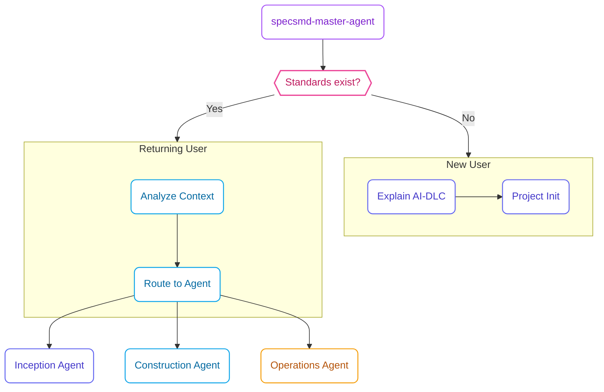

## Overview

The **Master Agent** is the orchestrator of the AI-DLC flow. It maintains awareness of the entire project state and routes you to the appropriate specialized agent.

## Invocation

<Tabs>
  <Tab title="Claude Code">
    ```bash
    /specsmd-master-agent
    ```
  </Tab>
  <Tab title="Cursor">
    ```
    /specsmd-master-agent
    ```
    Or use the `@` prefix:
    ```
    @specsmd-master-agent
    ```
  </Tab>
  <Tab title="GitHub Copilot">
    ```
    /specsmd-master-agent
    ```
  </Tab>
</Tabs>

## Commands

| Command | Purpose |
|---------|---------|
| `project-init` | Initialize project with standards |
| `analyze-context` | View current project state |
| `route-request` | Get directed to the right agent |
| `explain-flow` | Learn about AI-DLC methodology |
| `answer-question` | Get help with any specs.md question |

## project-init

Initializes your project with standards. This is typically the first command you run.

```
> project-init
```

The agent guides you through establishing:

<Steps>
  <Step title="Tech Stack">
    Languages, frameworks, databases, infrastructure choices
  </Step>
  <Step title="Coding Standards">
    Formatting, linting, naming conventions, testing strategy
  </Step>
  <Step title="System Architecture">
    Architecture style, API design, state management patterns
  </Step>
  <Step title="UX Guide (Optional)">
    Design system, styling, accessibility guidelines
  </Step>
  <Step title="API Conventions (Optional)">
    API style, versioning, response formats
  </Step>
</Steps>

Each standard is established through a facilitation guide that asks relevant questions and generates the standard document.

## analyze-context

Shows the current state of your project:

```
> analyze-context
```

Output includes:

- Active intents and their status
- Units in progress
- Current bolt stage
- Incomplete artifacts
- Suggested next actions

## route-request

When you're not sure which agent to use:

```
> route-request
> I want to add payment processing to my app
```

The Master Agent analyzes your request and directs you:

```
This sounds like a new Intent. You should use the Inception Agent 
to capture and elaborate this requirement.

Next step: /specsmd-inception-agent intent-create
```

## explain-flow

Get an explanation of the AI-DLC methodology:

```
> explain-flow
```

Topics you can ask about:

- The three phases (Inception, Construction, Operations)
- What Intents, Units, and Bolts are
- How checkpoints work
- Memory Bank structure

## answer-question

Get help with any specs.md question:

```
> answer-question
> How do I create an ADR?
```

The agent provides context-aware answers using:

- AI-DLC methodology knowledge
- Your project's current state
- Memory Bank artifacts

## Routing Flow

The Master Agent doesn't have checkpoints - it routes to specialized agents based on project state:



<Info>
  The Master Agent is the entry point. It determines where you are in the AI-DLC flow and routes you to the appropriate specialist agent.
</Info>

## When to Use Master Agent

<CardGroup cols={2}>
  <Card title="Starting a New Project" icon="play">
    Run `project-init` to establish standards
  </Card>
  <Card title="Unsure Where to Go" icon="compass">
    Use `route-request` to find the right agent
  </Card>
  <Card title="Need Orientation" icon="map">
    Run `analyze-context` to see project state
  </Card>
  <Card title="Learning AI-DLC" icon="graduation-cap">
    Use `explain-flow` for methodology guidance
  </Card>
</CardGroup>

## Example Session

```
User: /specsmd-master-agent

Master Agent: Welcome to specs.md! I'm the Master Agent. 
I can help you navigate the AI-DLC flow.

What would you like to do?
- project-init: Initialize a new project
- analyze-context: View current project state  
- route-request: Get directed to the right agent
- explain-flow: Learn about AI-DLC
- answer-question: Get help

User: project-init

Master Agent: Let's establish your project standards.

First, let's define your Tech Stack. 
What programming language(s) will you use?

User: TypeScript for everything

Master Agent: Great choice! TypeScript provides strong typing 
and excellent tooling. Let me ask a few more questions...

[Continues through facilitation guide]
```

## Best Practices

<AccordionGroup>
  <Accordion title="Start Here">
    For new projects, always start with the Master Agent and `project-init`.
  </Accordion>
  <Accordion title="Check Context Regularly">
    Use `analyze-context` to understand where you are in the flow.
  </Accordion>
  <Accordion title="Ask for Routing">
    When unsure, ask the Master Agent. It knows the methodology.
  </Accordion>
</AccordionGroup>
