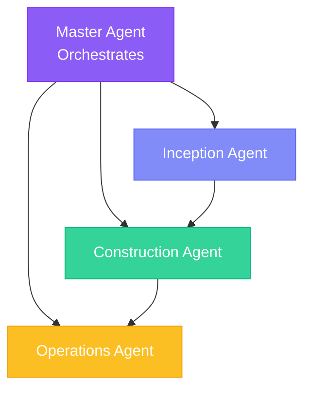

## The Agent System

specs.md provides four specialized agents that guide you through the entire development lifecycle. Each agent has a focused responsibility and set of commands.

## Agent Architecture



## Agent Responsibilities

<CardGroup cols={2}>
  <Card title="Master Agent" icon="crown" href="/agents/master-agent">
    Orchestrates the overall flow, routes requests, maintains project awareness
  </Card>
  <Card title="Inception Agent" icon="lightbulb" href="/agents/inception-agent">
    Captures intents, elaborates requirements, decomposes into units
  </Card>
  <Card title="Construction Agent" icon="hammer" href="/agents/construction-agent">
    Executes bolts, builds code, runs tests through validated stages
  </Card>
  <Card title="Operations Agent" icon="server" href="/agents/operations-agent">
    Deploys, verifies, and monitors systems in production
  </Card>
</CardGroup>

## Invoking Agents

<Warning>
  **These are NOT command-line commands.** These are prompts you type in your AI coding tool's chat interface (Claude Code, Cursor, Copilot, etc.).
</Warning>

### How to Use

1. Open your AI coding tool (Claude Code, Cursor, GitHub Copilot)
2. Start a chat/conversation
3. Type the agent prompt to activate it

<Tabs>
  <Tab title="Claude Code">
    Type in Claude Code's chat:
    ```
    /specsmd-master-agent
    /specsmd-inception-agent
    /specsmd-construction-agent
    /specsmd-operations-agent
    ```
  </Tab>
  <Tab title="Cursor">
    Type in Cursor's chat (either format works):
    ```
    /specsmd-master-agent
    /specsmd-inception-agent
    /specsmd-construction-agent
    /specsmd-operations-agent
    ```
    Or use the `@` prefix:
    ```
    @specsmd-master-agent
    @specsmd-inception-agent
    @specsmd-construction-agent
    @specsmd-operations-agent
    ```
  </Tab>
  <Tab title="GitHub Copilot">
    Type in Copilot's chat:
    ```
    /specsmd-master-agent
    /specsmd-inception-agent
    /specsmd-construction-agent
    /specsmd-operations-agent
    ```
  </Tab>
</Tabs>

## Agent Session Lifecycle

Each agent session follows a pattern:

<Steps>
  <Step title="Context Loading">
    Agent reads relevant artifacts from Memory Bank
  </Step>
  <Step title="Command Execution">
    Agent performs the requested command
  </Step>
  <Step title="Human Validation">
    Agent pauses for approval at checkpoints
  </Step>
  <Step title="Artifact Storage">
    Agent writes results back to Memory Bank
  </Step>
</Steps>

<Warning>
  Each agent invocation starts fresh. Agents read context from the Memory Bank at startup. Ensure artifacts are saved after each step.
</Warning>

## Command Reference

### Master Agent

| Command | Purpose |
|---------|---------|
| `project-init` | Initialize project with standards |
| `analyze-context` | View current project state |
| `route-request` | Get directed to the right agent |
| `explain-flow` | Learn about AI-DLC methodology |
| `answer-question` | Get help with any specs.md question |

### Inception Agent

| Command | Purpose |
|---------|---------|
| `intent-create` | Create a new intent |
| `intent-list` | List all intents |
| `requirements` | Elaborate intent requirements |
| `context` | Define system context |
| `units` | Decompose into units |
| `story-create` | Create stories for a unit |
| `bolt-plan` | Plan bolts for stories |
| `review` | Review inception artifacts |

### Construction Agent

| Command | Purpose |
|---------|---------|
| `bolt-start` | Start/continue executing a bolt |
| `bolt-status` | Check bolt progress |
| `bolt-list` | List all bolts |
| `bolt-replan` | Replan bolts if needed |

### Operations Agent

| Command | Purpose |
|---------|---------|
| `build` | Build the project |
| `deploy` | Deploy to environment |
| `verify` | Verify deployment |
| `monitor` | Set up monitoring |

## Routing Between Agents

The Master Agent can route you to the appropriate agent:

```
> I want to add a new feature

Master Agent: That sounds like a new Intent. Let me route you 
to the Inception Agent.

/specsmd-inception-agent intent-create
```

## Best Practices

<AccordionGroup>
  <Accordion title="Start with Master">
    When unsure where to begin, start with the Master Agent. It will guide you to the right place.
  </Accordion>
  <Accordion title="Complete Artifacts">
    Finish and save artifacts before switching agents. Context is loaded from Memory Bank.
  </Accordion>
  <Accordion title="Follow the Flow">
    Inception → Construction → Operations. Don't skip phases.
  </Accordion>
  <Accordion title="Use Commands">
    Each agent has specific commands. Use them rather than free-form requests.
  </Accordion>
</AccordionGroup>
