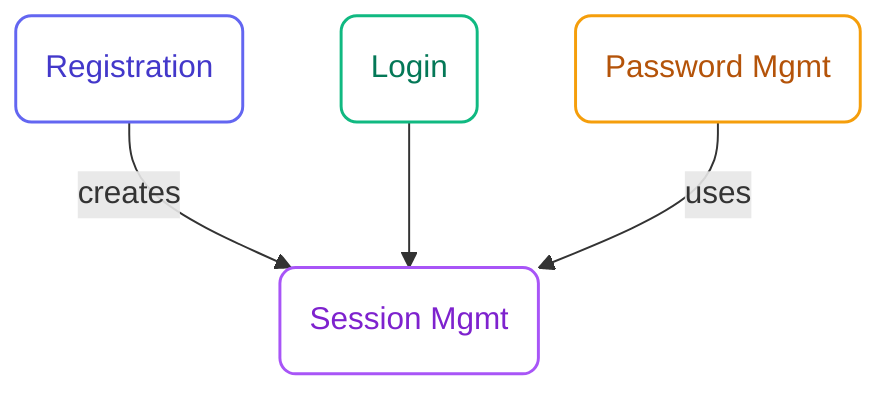

## What is a Unit?

A **Unit** is a cohesive, self-contained work element derived from an Intent. Units are loosely coupled and can be developed independently.

<Info>
  A Unit is analogous to a **Subdomain** in DDD or an **Epic** in Scrum, but with clearer boundaries and AI-assisted decomposition.
</Info>

## Unit Characteristics

<CardGroup cols={2}>
  <Card title="Cohesive" icon="object-group">
    All elements within a unit serve a single, focused purpose
  </Card>
  <Card title="Self-Contained" icon="box">
    Can be developed and tested independently
  </Card>
  <Card title="Loosely Coupled" icon="link-slash">
    Minimal dependencies on other units
  </Card>
  <Card title="Well-Bounded" icon="border-all">
    Clear interfaces with the rest of the system
  </Card>
</CardGroup>

## Example: Authentication Intent → Units

An "User Authentication System" intent might decompose into:

```
Intent: User Authentication System
├── Unit: User Registration
│   ├── Registration form
│   ├── Email validation
│   └── Account creation
├── Unit: User Login
│   ├── Login form
│   ├── Session management
│   └── Remember me
├── Unit: Password Management
│   ├── Password reset
│   ├── Password change
│   └── Password policies
└── Unit: Session Management
    ├── Token handling
    ├── Session expiry
    └── Logout
```

## Unit Structure

Each unit lives in its own directory:

```
memory-bank/intents/{intent}/units/{unit-name}/
├── unit-brief.md        # Unit definition and scope
├── stories/             # User stories for this unit
│   ├── story-001.md
│   └── story-002.md
└── bolts/               # Bolt execution records
    ├── bolt-001/
    └── bolt-002/
```

## Unit Brief

The `unit-brief.md` defines the unit:

```markdown
# Unit: User Registration

## Purpose
Enable new users to create accounts in the system.

## Scope

### In Scope
- Email/password registration
- Email validation
- Account creation in database
- Welcome email

### Out of Scope
- Social login (separate unit)
- Profile management (separate unit)

## Dependencies
- Email Service (external)
- User Database (shared)

## Interfaces

### Inputs
- Registration form data (email, password)

### Outputs
- User account created
- Confirmation email sent

## Stories
- US-001: User Registration Form
- US-002: Email Validation
- US-003: Welcome Email
```

## Decomposing into Units

The Inception Agent helps decompose intents:

```bash
/specsmd-inception-agent units
```

The agent will:

<Steps>
  <Step title="Analyze Requirements">
    Review user stories and NFRs from the intent
  </Step>
  <Step title="Identify Boundaries">
    Find natural groupings based on cohesion
  </Step>
  <Step title="Propose Units">
    Suggest unit structure with rationale
  </Step>
  <Step title="Define Interfaces">
    Establish how units communicate
  </Step>
  <Step title="Map Dependencies">
    Identify unit interdependencies
  </Step>
</Steps>

## Unit Dependencies

Units should be loosely coupled, but some dependencies are natural:



<Warning>
  Circular dependencies between units indicate poor decomposition. If Unit A depends on Unit B and Unit B depends on Unit A, consider merging them or extracting the shared concern.
</Warning>

## Best Practices

<AccordionGroup>
  <Accordion title="Single Responsibility">
    Each unit should have one clear purpose. If a unit is doing too many things, split it.
  </Accordion>
  <Accordion title="Clear Boundaries">
    Define explicit interfaces. Other units should only interact through these interfaces.
  </Accordion>
  <Accordion title="Independent Development">
    You should be able to work on a unit without constantly coordinating with other units.
  </Accordion>
  <Accordion title="Testable in Isolation">
    A unit should be testable without requiring the full system.
  </Accordion>
</AccordionGroup>

## Next Steps

<Card
  title="Bolts"
  icon="arrow-right"
  href="/core-concepts/bolts"
>
  Learn how Units are implemented through Bolts
</Card>
