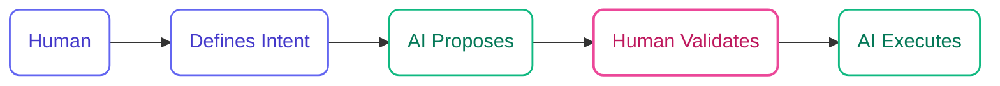

## Side-by-Side Comparison

| Aspect | Agile/Scrum | AI-DLC |
|--------|-------------|--------|
| **Iteration Duration** | Weeks (Sprints) | Hours/Days (Bolts) |
| **Who Drives** | Human-driven, AI assists | AI-driven, human-validated |
| **Design Techniques** | Out of scope | Integrated (DDD in construction bolts) |
| **Task Decomposition** | Manual | AI-powered |
| **Phases** | Repeating sprints | Rapid three-phase cycles |
| **Rituals** | Daily standups, retrospectives | Mob Elaboration, Mob Construction |
| **Documentation** | Often neglected | Built-in artifacts |
| **Context Engineering** | Lost between sprints | Specs + Memory Bank |

## Iteration: Sprints vs Bolts

<Tabs>
  <Tab title="Agile Sprints">
    - **Duration**: 1-4 weeks
    - **Planning**: Sprint planning ceremony
    - **Execution**: Daily standups, continuous work
    - **Review**: Sprint review, retrospective
    - **Output**: Potentially shippable increment
  </Tab>
  <Tab title="AI-DLC Bolts">
    - **Duration**: Hours to days
    - **Planning**: AI-powered decomposition
    - **Execution**: Stage-gated progression
    - **Review**: Human validation at each checkpoint
    - **Output**: Validated, tested feature
  </Tab>
</Tabs>

## Role Inversion

### Traditional Agile


Humans drive the entire process. AI tools (copilots, assistants) help with specific tasks but don't lead.

### AI-DLC



AI leads the conversation. Humans provide intent and validation. AI handles decomposition, planning, and execution.

## Design Techniques

<CardGroup cols={2}>
  <Card title="Agile Approach" icon="question">
    Design techniques like DDD are optional. Many teams skip them due to time pressure, leading to technical debt.
  </Card>
  <Card title="AI-DLC Approach" icon="check">
    Domain-Driven Design is built into DDD construction bolts. You can't skip Domain Modeling - it's a required gate.
  </Card>
</CardGroup>

## Bolt Types with Built-in Design

| Bolt Type | Best For | Stages |
|-----------|----------|--------|
| **DDD Construction** | Complex domain logic, business rules | Model → Design → ADR → Implement → Test |
| **Simple Construction** | UI, integrations, utilities | Plan → Implement → Test |

## Context Engineering

<Warning>
  One of the biggest challenges in traditional Agile is context loss between sprints. Knowledge leaves with team members, decisions aren't documented, and the codebase becomes a mystery.
</Warning>

### AI-DLC Solution: Specs + Memory Bank

Specs and Memory Bank provide structured context for AI agents:

- All project artifacts (requirements, designs, decisions)
- Traceability between artifacts
- Context that agents can reload in any session

```
memory-bank/
├── intents/           # What we're building
├── bolts/             # How we built it
├── standards/         # Project decisions
└── operations/        # Deployment context
```

## When to Use Each

<Tabs>
  <Tab title="Use Agile When">
    - Team is not using AI coding tools
    - Organization has established Agile processes
    - Regulatory requirements mandate specific ceremonies
    - Team prefers human-led planning
  </Tab>
  <Tab title="Use AI-DLC When">
    - Building with AI coding assistants
    - Need rapid iteration cycles
    - Want integrated design practices
    - Building complex systems
    - Context persistence is critical
  </Tab>
</Tabs>

## Migration Path

AI-DLC retains familiar concepts to ease transition:

| Agile Concept | AI-DLC Equivalent |
|---------------|-------------------|
| Epic | Intent |
| User Story | Story (within Unit) |
| Sprint | Bolt |
| Backlog | Intent/Unit definitions |
| Definition of Done | Checkpoint validations |
