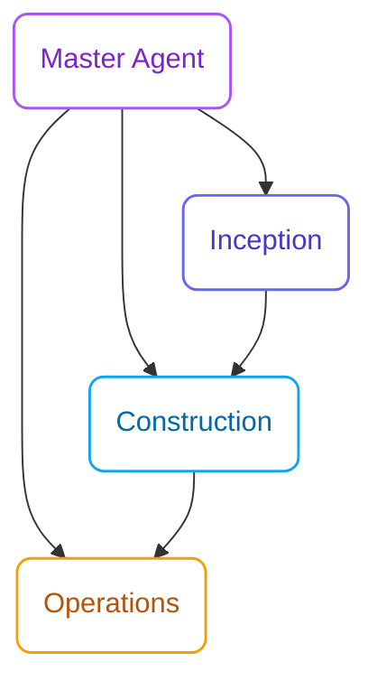

## The AI-Driven Development Lifecycle

AI-DLC is the first development flow implemented in specs.md. It's a reimagined software development methodology where **AI drives the conversation** and humans validate. Unlike traditional Agile where iterations span weeks, AI-DLC operates in **Bolts** - rapid iterations measured in hours or days.

<Info>
  AI-DLC was developed by AWS and documented in their [AI-Driven Development Life Cycle](https://aws.amazon.com/blogs/devops/ai-driven-development-life-cycle/) blog post. specs.md implements this methodology as a pluggable flow.
</Info>

## The Core Insight

> "Traditional development methods were built for human-driven, long-running processes. AI-DLC reimagines the development lifecycle with AI as a central collaborator, enabling rapid cycles measured in hours or days rather than weeks."

## Key Principles

<CardGroup cols={2}>
  <Card title="AI-Driven" icon="robot">
    AI leads the conversation, proposes solutions, and generates artifacts. Humans validate and guide.
  </Card>
  <Card title="Rapid Iterations" icon="bolt">
    Bolts replace Sprints. Complete meaningful work in hours, not weeks.
  </Card>
  <Card title="Human Checkpoints" icon="door-open">
    Human validation at each checkpoint catches errors before they cascade.
  </Card>
  <Card title="Design-First" icon="compass-drafting">
    Domain-Driven Design is built into construction bolts, not an afterthought.
  </Card>
</CardGroup>

## The Three Phases

AI-DLC organizes work into three phases, each with a specialized agent:

| Phase | Purpose | Key Outputs |
|-------|---------|-------------|
| **Inception** | Capture intents, elaborate requirements | User stories, NFRs, Unit definitions |
| **Construction** | Execute bolts through validated stages | Domain models, Code, Tests |
| **Operations** | Deploy, verify, and monitor | Deployment units, Runbooks |

## Why AI-DLC?

### The Problem with Traditional Methods

Traditional Agile methods have "whitespace" - areas left undefined that lead to:

- Inconsistent architecture decisions
- Missing design documentation
- Quality issues from skipped steps
- Context loss between iterations

### The AI-DLC Solution

AI-DLC fills these gaps by:

1. **Integrating design techniques** - DDD is integrated into construction bolts
2. **Creating persistent artifacts** - Memory Bank maintains context
3. **Enforcing checkpoints** - Each validation point ensures quality
4. **Enabling rapid iteration** - AI-powered decomposition and execution

## When to Use AI-DLC

AI-DLC is the right choice when:
- You have a team requiring coordination
- Your domain logic is complex and benefits from DDD
- You need comprehensive documentation and traceability
- You're in a regulated environment with audit requirements

<Info>
  **Need less ceremony?** specs.md offers two lighter flows:
  - **[FIRE Flow](/fire-flow/overview)** - Adaptive execution with brownfield & monorepo support
  - **[Simple Flow](/simple-flow/overview)** - Spec generation only, no execution tracking

  [Compare all flows →](/architecture/choose-flow)
</Info>

## Next Steps

<CardGroup cols={2}>
  <Card
    title="AI-DLC vs Agile"
    icon="scale-balanced"
    href="/methodology/ai-dlc-vs-agile"
  >
    Detailed comparison with traditional methods
  </Card>
  <Card
    title="The Three Phases"
    icon="diagram-project"
    href="/methodology/three-phases"
  >
    Deep dive into Inception, Construction, Operations
  </Card>
</CardGroup>
