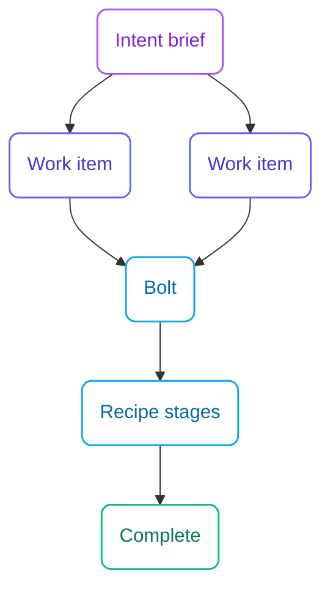

The unified flow has a short vocabulary. This page is the map. Recipes and skills have their own reference pages.

## Hierarchy

**Intent → work item**, with a **bolt** as the execution container.

| Concept | Role |
|---------|------|
| **Intent** | The outcome you want. Problem, outcome, scope, non-goals. No mechanism. |
| **Work item** | A vertical slice of that outcome, with a behavioral Definition of Done, complexity, and dependencies. |
| **Bolt** | The container that *does* the work. Created when you start. Groups one or more work items — they may come from more than one intent. |

There is no unit or story layer. Draft bolts are optional proposals; they are not required before execution.



## Bolt

A bolt is created when work starts — not as a prerequisite of shaping. `bolt-start` records the work items, the **recipe**, and the **ceremony**. Those three do not change afterward. A wrong choice is resolved by completing or abandoning the bolt and starting another.

- Status lives in `docs/specsmd/bolts/{id}/bolt.md` frontmatter.
- Resume uses `current_stage` and `checkpoint_state`, never “which files happen to exist.”
- Completing a bolt completes every tracked work item, or none if required evidence or gating criteria are missing.
- Every completed bolt yields a human-facing walkthrough: what changed, why, deviations from plan, how to verify. The walkthrough contains no source code.

Optional **draft bolts** (`bolt-plan`) name a grouping and a suggested recipe. Starting a bolt may **adopt**, **modify**, or **ignore** drafts. Unadopted drafts age harmlessly.

## Recipe

A recipe is a **stage catalog**: ordered stages, what each stage produces, which stages may carry an approval gate, and any declarative constraints (for example a time box, or “no source code in these stages”).

Four recipes ship with the flow: `default`, `ddd`, `spike`, `simple`. Add a project-local recipe by adding one YAML file under `docs/specsmd/recipes/`. No other change is needed.

The recipe is snapshotted onto the bolt at creation. Editing the YAML later does not change an in-flight bolt.

When you omit a recipe, the flow recommends from the work items' complexity:

| Complexity | Recommended recipe |
|------------|--------------------|
| `low` | `simple` |
| `medium` | `default` |
| `high` | `ddd` |

Your choice always wins. See the [recipe reference](/v2/recipes).

## Ceremony dial

Ceremony is how many times the flow stops for approval. It is **not** a phase and **not** a skill sequence.

Inputs:

1. **Complexity** on the work item — decision load, not file count: `low` (no new correctness or interoperability decisions), `medium` (local decisions inside an existing shape), `high` (new cross-cutting decisions).
2. **Autonomy bias** on the project — `autonomous`, `balanced` (default), or `controlled`. Set once at `specsmd-init`.

Those two select a ceremony. The user's explicit choice at `bolt-start` always wins. If the user picks nothing, the bolt uses the most controlled `ceremony_suggested` among the chosen work items.

| Complexity | autonomous | balanced | controlled |
|------------|------------|----------|------------|
| `low` | autopilot | autopilot | confirm |
| `medium` | autopilot | confirm | validate |
| `high` | confirm | validate | validate |

| Ceremony | Gates |
|----------|--------|
| `autopilot` | None. Stages advance after their artifacts exist. |
| `confirm` | The recipe's **first** gateable stage waits. |
| `validate` | **Every** gateable stage waits. |

At `confirm` and `validate`, the approval turn must include the **full text** of the stage's artifacts — the whole plan, not a summary. Approval phrases (`yes`, `approved`, `lgtm`, …) grant the gate. Denial leaves it `awaiting`.

“AI plans, human validates” is the controlled end of the dial, not a separate mode.

## Lenses

Inception, Construction, and Operations survive as **views**, not gated modes. The navigator (`specsmd-status`) reports three lenses:

| Lens | What you see |
|------|----------------|
| **Shaping** | Intents and work items not yet named on any non-draft bolt |
| **Building** | Active bolts, with current stage and checkpoint |
| **Shipping** | Completed bolts. A slim release checklist is available; nothing gates on release. |

Empty lenses stay visible. Lenses never restrict which skill you may invoke.


## nlspec

Intents and work items are **natural language specs**: engineering-grade prose about *observable behavior*. The dividing question is:

> Does this decision affect correctness or interoperability of the outcome? If yes, specify it. If no, leave it to the implementer — and when the freedom is deliberate, say so.

A spec may state interface contracts, data shapes, defaults, bounds, and error recovery. It never states implementation file names, module layout, language choice, or source code.

Every work item ends in a **Definition of Done**: binary, black-box checks marked **gating** (completion is impossible while unmet) or **advisory**.

The spec is the source of truth. When code and spec conflict, the spec wins or the spec is fixed — never a silent deviation.

See [Writing nlspecs](/v2/nlspec).

## Memory model

The artifact tree is the project's memory. There are exactly two classes:

| Class | Meaning | Typical homes |
|-------|---------|----------------|
| **Semantic** | Current truth. Kept true. Default read path. | `system/`, `standards/`, the decisions **index**, `project.md`, recipes |
| **Episodic** | History. Valuable, kept, never the default read. | Completed intents, work items, bolts; individual decision records |

Change records (intents, work items, bolts) are **semantic while they are not terminal** and **episodic once `complete` or `abandoned`**. Memory class is derived from status, not stored as a separate field.

**Read path:** `system/`, standards, and the decisions index first. Open an episodic artifact only when a semantic document points at it, or when you ask for history.

**Projection:** when a bolt completes, the flow matches its scope against registered `system/` documents and asks you to confirm or update those documents. Declining still completes the bolt; an advisory integrity finding remains.

**Decisions:** each decision is an immutable event. Which decisions are **in force** is semantic — listed only on `docs/specsmd/decisions/index.md`, each with a “consult when” hint. Superseding adds a new record, updates the index, and points the old record upward.

**Forgetting:** archival is refused while a record still holds uncaptured truth (a decision missing from the index, or a behavior change reflected in no semantic document). An explicit override exists and is recorded.

## State

- Artifact root is `docs/specsmd/`. Specs are browsable project documentation, not hidden tool state.
- State lives in YAML frontmatter on the artifacts themselves. There is **no** central state file.
- Only the flow's scripts write status fields. Skills and humans write bodies (`brief.md`, `plan.md`, walkthroughs).
- Status tokens are exactly `draft`, `pending`, `active`, `complete`, `abandoned`. Synonyms such as `in-progress` or `done` are errors.

```
docs/specsmd/
├── project.md
├── intents/{id}/brief.md
├── intents/{id}/work-items/{id}.md
├── bolts/{id}/bolt.md
├── recipes/{id}.yaml
├── standards/
├── decisions/           # records + index.md (in-force list)
└── system/              # current truth
```

## Recommend, don't enforce

Skills never name a required next skill. The navigator suggests; every suggestion is declinable. Scripts refuse only illegal state changes (missing evidence, unmet gating criteria, dependency cycles). A refused completion is not a prompt to edit frontmatter by hand.

## Standards (guardrails)

Technical opinions that specs deliberately leave out live in `docs/specsmd/standards/`. A **constitution** holds everywhere and is never overridden. Other standards (tech stack, coding, testing, architecture, nlspec) resolve by nearest scope in a monorepo. Violations are reported as remediations: what to change, where, and which standard says so.
