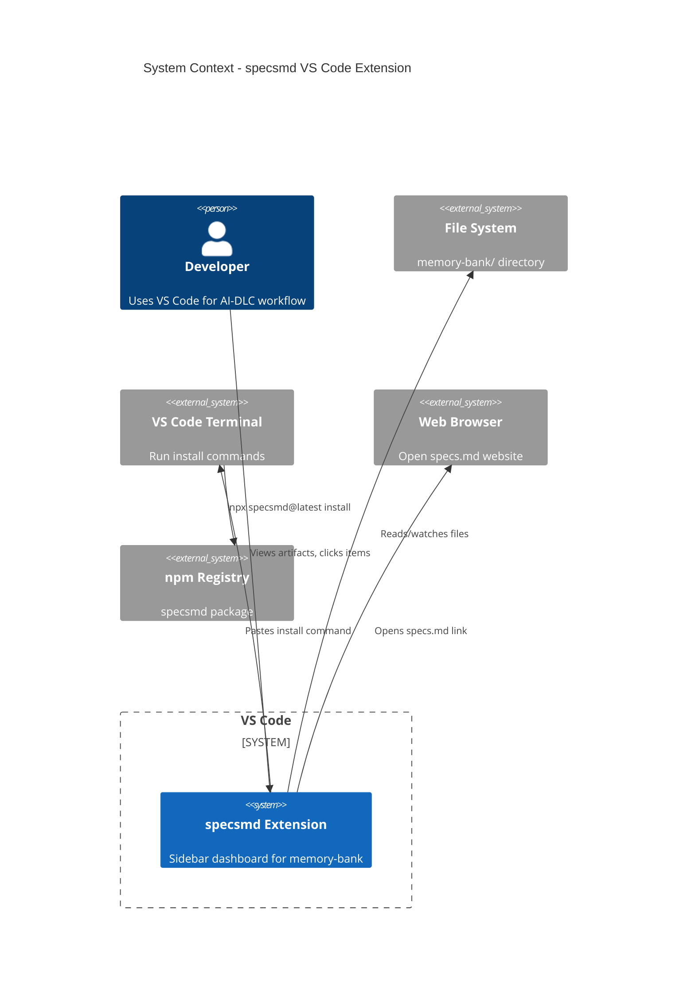

# VS Code Extension - System Context

## System Overview

A VS Code extension ("specsmd extension") that provides a sidebar dashboard for browsing AI-DLC memory-bank artifacts. The extension runs entirely within VS Code, reading local files and providing a tree view interface for navigating intents, units, stories, bolts, and standards.

## Context Diagram

## Actors

| Actor | Type | Description |
|-------|------|-------------|
| Developer | Human | Primary user, browses memory-bank via sidebar |
| VS Code | System | Host environment, provides Extension API |
| File System | System | Source of memory-bank artifacts |
| VS Code Terminal | System | Target for install command paste |
| Web Browser | System | Opens specs.md website from logo click |

## External Integrations

| System | Purpose | Direction | Protocol |
|--------|---------|-----------|----------|
| VS Code Extension API | Host environment, tree view, commands | Bidirectional | TypeScript API |
| File System | Read artifacts, watch for changes | Inbound | Node.js fs/vscode.workspace |
| VS Code Terminal | Paste install command | Outbound | vscode.terminal API |
| Web Browser | Open specs.md website | Outbound | vscode.env.openExternal |
| npm Registry | specsmd installation | Indirect | npm/npx (user-initiated) |

## Data Flows

### Inbound

| Source | Data | Format | Processing |
|--------|------|--------|------------|
| File System | Artifact files | Markdown with YAML frontmatter | Parse frontmatter for status |
| File System | Directory structure | Folders | Build tree hierarchy |
| File Watcher | Change events | Create/Modify/Delete | Update tree view |
| User | Click events | VS Code events | Open file / expand node |

### Outbound

| Target | Data | Format | Trigger |
|--------|------|--------|---------|
| VS Code Tree View | Artifact tree | TreeDataProvider | File changes, refresh |
| VS Code Editor | File path | URI | Double-click |
| VS Code Terminal | Install command | String | Install button click |
| Web Browser | specs.md URL | URL | Logo click |
| Clipboard | File path / command | String | Copy action |

## High-Level Constraints

| Constraint | Rationale |
|------------|-----------|
| VS Code ^1.85.0 | Minimum version for required APIs |
| Single workspace only | No multi-root workspace support (Phase 1) |
| Read-only dashboard | No artifact creation/modification (Phase 1) |
| No custom editors | Use VS Code default editors (Phase 1) |
| Local files only | No remote/cloud memory-bank support |

## Key NFR Goals

| Category | Goal |
|----------|------|
| Performance | Tree loads < 500ms for 100 artifacts |
| Responsiveness | File changes reflected < 1 second |
| Memory | Extension footprint < 50MB |
| Reliability | Graceful handling of malformed files |
| UX | Follow VS Code tree view conventions |

## Assumptions

| Assumption | Impact if Invalid |
|------------|-------------------|
| memory-bank at workspace root | Add configurable path setting |
| Standard directory structure | Parser fails, show "?" status |
| YAML frontmatter in artifacts | Fallback to "unknown" status |
| Node.js available in VS Code | Core dependency, will fail |

## Out of Scope

- Remote/cloud memory-bank storage
- Multi-root workspace support
- Custom editors for artifacts
- Direct bolt execution
- Git integration
